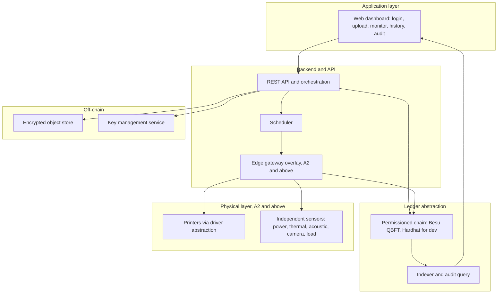
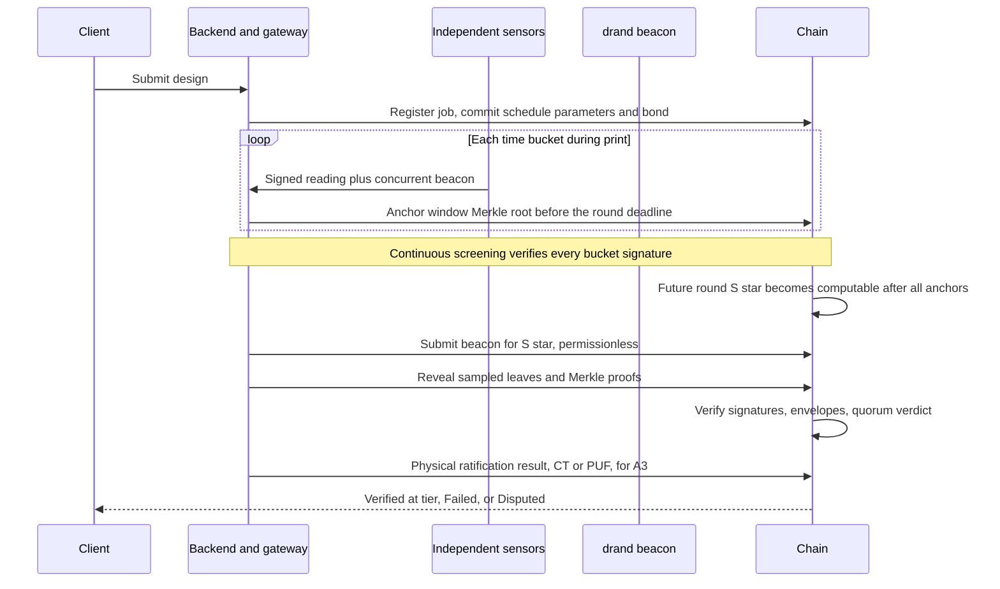

# Architecture

This document describes the system architecture, the trust model, the verifiable-execution protocol, the data model, and the smart contracts. It is the technical reference for the requirements in [PRD.md](PRD.md) and the build plan in [Phases.md](Phases.md).

## 1. Design principles

1. Cryptography cannot vouch for physical reality it did not independently observe. Every guarantee is scoped to the trust configuration that earns it.
2. The chain is the substrate at every tier. The security claim is what is tiered, not whether a blockchain exists.
3. The single trust root is independent physical observation plus physical ratification of the delivered part. Every cryptographic mechanism only verifies inputs.
4. Fail closed. When the independence a stronger claim depends on is absent, the system drops to the weaker honest claim and says so.
5. Keep design intellectual property off-chain and encrypted. Anchor only small, non-personal commitments on-chain.

## 2. The assurance ladder

The tier gates the claim, not the presence of the blockchain.

| Tier | Claim | Requirement | Payment |
| --- | --- | --- | --- |
| A0 | Tamper-evident. Edits detectable. EU rebuttable time presumption. Not BFT. | Base product on a permissioned chain. | Manual or invoice. |
| A1 | Tamper-resistant across parties. | Two or more adverse-interest orgs each run a validator. Four or more validators to tolerate one fault. | On-chain roles. Optional escrow. |
| A2 | Quantified anti gross-false-completion. | At least one verified independent witness. | No automatic release. |
| A3 | Physically verified correct part. | Independent witness plus CT or PUF custody. | Payment gates here. One hundred percent CT for safety-critical. |

Enforcement: the tier is a verifiable on-chain function of a signed independence-attestation chain. A non-operator counterparty co-signs the witness enrollment. The user interface renders only the tier the contract stamped. Absent a valid attestation, the tier defaults to A0. A job committed at A3 whose witness goes absent resolves to Held or Failed, never to Verified at A0.

## 3. High-level architecture

## 4. The two telemetry planes

This split is load-bearing for the verification guarantee.

- Machine-reported plane, untrusted. Data comes from the printer firmware or API, such as temperatures, position, layer, and progress. It is used for the dashboard, scheduling, and operator experience only. It never anchors the proof.
- Independent-observation plane, trusted at A2 and above. External sensors are physically separated from the printer controller. The protocol samples this plane. The primary anchor is the alternating-current power side channel, which reveals real motor and heater work the controller cannot fake. It is corroborated by acoustic, vibration, thermal, camera, and load-cell signals, cross-checked for physical consistency.

## 5. The four trust mechanisms

1. Sign at the sensor, required at A2 and above. Each trusted sensor signs the hash of its reading combined with the current randomness beacon at the source. On-chain verification checks per-sensor signatures. A gateway aggregate signature is never sufficient on its own.
2. Independent witness, the gating trust root. At least one sensor is owned and sealed by a party other than the operator. Multiple sensors the operator controls do not reduce collusion trust.
3. Confidentiality enclave, not a trust root. An attested confidential virtual machine may hold the per-job decryption key for confidentiality only. It is treated as breakable for integrity. If used for verdicts, it must be an n of m quorum across heterogeneous hardware vendors, hosted by the customer or the consortium.
4. Ledger binding plus physical ratifier. The chain accepts a commitment only if signed by an enrolled key. The verdict is one input to a quorum plus the physical CT or PUF ratifier, never a sole oracle.

## 6. Data model

Frozen enumerations: Role is None, Client, Operator, Admin, Auditor. PrinterStatus is idle, printing, offline, maintenance, compromised. AssuranceTier is A0, A1, A2, A3. Verdict is none, VerifiedA0, VerifiedA2, VerifiedA3, Failed, Disputed.

| Entity | Key fields |
| --- | --- |
| User | id, org, role, authSubject, status, grantedBy, createdAt |
| Printer | id, model, driverType, buildVolume, materials, toleranceClass, location, status, health, devicePubKey, capabilities |
| MaterialLot | id, type, lot, density, nominalTemps, costPerGram, stockQty, supplier, provenanceRef |
| Job | id, clientId, designRef, sliceProfileRef, materialLotRef, printerId, status, assuranceTier, objectRef, fileHash, provenanceDAGRefs, verificationRef, timestamps |
| DesignArtifact and SliceArtifact | contentHash, parentHash, tool and version, params |
| TelemetrySample | jobId, bucket, modalityValues, plane, signature, beaconRef |
| VerificationRecord | jobId, scheduleCommit, merkleRoots, drawnSet, verdict, independenceAttestationRef, partBindingResult |
| AuditEvent | seq, actor, action, target, prevHash, timestamp, signature |

The audit events form one unified, hash-chained, monotonic stream that spans both operational actions and verification events.

## 7. Smart contracts

Six components. The VerificationContract is non-upgradeable. The other five are upgradeable behind a timelock and multisig. An upgradeable verifier would undermine the immutability guarantee.

| Contract | Responsibility |
| --- | --- |
| AccessControlHub | Role and permission management per function. Timelock and guardian. Admin is a multisig. |
| PrinterRegistry | Printer identity, capabilities, health, enrolled device key, independence attestation enrollment. |
| JobRegistry | Job lifecycle finite state machine, random non-personal job id, events as the canonical audit stream, certification-gated authorization. |
| VerificationContract | Merkle root commits, permissionless audit draw, on-chain sampled-leaf verification, quorum verdict intake, tier stamping from the attestation chain, physical binding result. Immutable. |
| SettlementEscrow (A1 and above) | Releases only on Verified at A3. Distinguishes Fail from verdict-unavailable. Dispute path with no automatic slash on low confidence. Bond disposition for every terminal state. Neutral arbitration. |
| Proxy and governance | Upgrade control, storage layout discipline, continuous integration checks. |

Data strategy: one Merkle root per job plus snapshot events, rather than many storage writes. Per-epoch aggregation at fleet scale. This keeps on-chain cost bounded regardless of the number of snapshots.

## 8. The verifiable-execution protocol (A2 and A3)

The mechanism proves that non-trivial, correctly phased physical activity occurred at unpredictable, independently observed moments. It is a commit-then-beacon protocol.

Randomness: drand quicknet, a threshold randomness beacon with a unique value per round that cannot be ground and can only be halted. Each snapshot embeds the concurrent beacon, which binds it to real time and blocks offline fabrication. The audited subset is derived from a future beacon round that becomes computable only after every root is anchored. The seed combines the future beacon with a commit-reveal or verifiable-delay entropy source fixed before the reveal, so neither the beacon operators alone nor a colluding validator alone can predict the draw.

Statistical bound: the probability of evading detection for gross false completion is approximately e to the power of minus q times phi times n, where phi is the faked fraction, n is the number of samples, and q is a conservatively floored, empirically calibrated detection probability. This bound covers gross false completion only. Localized sabotage, such as a single weakened layer, is not caught by sampling. It is addressed by continuous screening of every bucket and by physical ratification at A3.

Payment: releases only against physical binding at A3, never on telemetry alone. Safety-critical parts require one hundred percent CT rather than a sampled subset.

## 9. Identity, access control, and keys

- Three planes: humans through single sign-on, upgraded to smart accounts with attestations at A1 and above. Machines enrolled with secure-element device keys at A2 and above. Governance through a role manager with a multisig and a timelock.
- The base tier uses plain single sign-on with application role-based access control mirrored to the contract, so no chain-dependent identity is required to start.
- Revocation is forward safe. In-flight jobs are frozen. Already settled jobs are never silently invalidated. Contested cases route to arbitration.
- Key custody by class: key management service or multi-party computation for organization keys, smart accounts with social recovery for humans, secure elements for device keys.

## 10. Storage and confidentiality

- Source of truth is a private, encrypted-at-rest object store with content addressing. A permanent anchor copy may be kept for the final verified artifact.
- Envelope encryption. A per-job data key encrypts the payload. The data key is wrapped by a key encryption key held in a key management service. Destroying the wrapped data key crypto-shreds the off-chain payload.
- On-chain minimization. Only commitments to non-personal random tokens are stored, salted, with padding and timing decoupling to limit metadata leakage.
- Honest last-mile limit. G-code is the intellectual property, and the printer must receive it in plaintext on an unattested device the operator controls. Confidentiality against the executing operator for that job's toolpath is not achievable with commodity printers. The claim is scoped to protecting the archive and other jobs, with the remaining exposure handled contractually.

## 11. Ledger abstraction

The same contract interface and event schema run on a permissioned chain, where the logic is consensus enforced, or on a signed transparency log fallback, where the same logic executes as trusted application code and is evidenced rather than enforced. This keeps the application portable and gives a clean upgrade path from a single-node pilot to a multi-organization consortium.

## 12. Deployment configurations

- One independent organization, or invoice-settled work: A0. A solo permissioned chain provides the audit trail and the migration path, with qualified timestamps. The solo form is not marketed as trustless.
- Two or more adverse-interest organizations each running a validator, with on-chain settlement needed and no export bar: A1, with A2 and A3 added as trust hardware allows.
- Medical or export-controlled: constrained variants. Keep personal data off-chain and deletable, use a jurisdiction-appropriate enclave, and turn public anchoring off by default.

## 13. Compliance posture

Personal data stays off-chain. Only non-personal commitments are anchored. Legal-grade timestamps come from a qualified timestamp authority, not from the chain itself. Standards are targeted as "designed to support conformance," not as certification. Relevant references include the additive-manufacturing digital-thread and blockchain traceability guidance, industrial control-system security, information-security management, and the vertical rules for medical and aerospace where they apply.

## 14. Residual trust and honest limits

The system trusts, and openly documents, the following: the physical to sensor transduction, at least one honest independent witness, the hardware roots of the trusted execution environments, that reproducible builds match audited source, chain and contract correctness, the sensor supply chain, the randomness beacon operators, and the enclave host physical security. In one sentence: cheating is made expensive, multi-party collusive, and probabilistically detectable, never cryptographically impossible.
