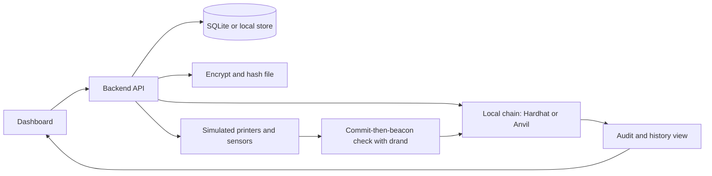

# MVP

This document defines a minimum viable product that is free to build, deployable, and designed to be shown to investors. The goal of the MVP is to demonstrate a working, credible product and a clear path to a defensible moat, so the project can raise funds and then build the full system.

## 1. Objective

Show investors three things in one running demo:

1. A real, working fleet-management product on a real blockchain. Upload a design, authorize it, schedule it to a printer, run it, and see a complete history.
2. A tamper-evident audit trail. Try to alter a record and watch the system detect it.
3. A credible verification moat. Demonstrate, in simulation, how the system catches a printer that claims a job is done without doing the work.

The MVP is the A0 tier of the assurance ladder, plus a simulated preview of the A2 anti-false-completion check. It is honest about what is real and what is simulated.

## 2. Guiding constraint: free to build

Every component in the MVP uses free and local tooling. There is no paid cloud, no purchased hardware, and no license cost. The entire MVP can run on a single laptop and can optionally be deployed to a free public test network to show a live public chain.

## 3. Scope

In scope for the MVP:

- User login and role-based access control (Admin, Operator, Client, Auditor).
- Solidity smart contracts on a local chain for access control and the job lifecycle.
- Design file upload with encryption at rest and content-addressed hashing.
- Anchoring of the file hash and job metadata on-chain.
- A scheduler that routes a job to a capable, available printer.
- Simulated printers and a simulated sensor stream, so no hardware is required.
- A simulated anti-false-completion check: the commit-then-beacon idea run against simulated legitimate and fake telemetry, showing detection.
- A dashboard: fleet monitor, job submission, print history, and an audit viewer with verifiable timestamps.
- A synthetic dataset generator that produces jobs, materials, telemetry, and user records.
- An audit export that can be re-verified.

Explicitly out of scope for the MVP, and clearly labeled as the funded roadmap:

- Physical sensors and the edge gateway hardware.
- The confidentiality enclave and hardware key custody.
- A multi-organization validator consortium.
- Physical part ratification by X-ray CT or PUF.
- On-chain payment settlement and bonds.

This separation is intentional. The MVP proves the product and the verification concept for zero cost. The funded phases add the trust hardware that only pays off for regulated, high-value customers.

## 4. Free and local technology stack

| Concern | MVP choice | Cost |
| --- | --- | --- |
| Blockchain | Hardhat or Anvil local chain. Optional free public testnet for a live demo. | Free |
| Smart contracts | Solidity with OpenZeppelin libraries. | Free |
| Chain interaction | ethers or web3 from the backend. | Free |
| Backend and API | Python with FastAPI, or Node. | Free |
| Datastore | SQLite for the MVP, or local MinIO for object storage. | Free |
| Encryption | AES-256-GCM with a locally held key encryption key. Software key store for the MVP. | Free |
| Randomness | drand public beacon, read over its free public endpoints. | Free |
| Sensor and printer simulation | Python with numpy time series. | Free |
| Frontend | React, or plain HTML and JavaScript. | Free |
| Hosting | Local laptop for the pitch. Optional free-tier host or a static frontend with a local backend. | Free |

Total direct cost to build and run the MVP: zero.

## 5. MVP architecture

Everything above runs locally. The only external call is a read from the free public drand beacon, which can also be stubbed for a fully offline demo.

## 6. Build blocks for the MVP

These map to the feature inventory in [Features.md](Features.md) and the plan in [Phases.md](Phases.md). The MVP corresponds to Phase A.

1. Contracts: AccessControlHub, PrinterRegistry, JobRegistry. Deploy scripts for the local chain.
2. Backend: job orchestration, encryption and hashing, chain bindings, scheduler, dataset generator.
3. Auth and roles: login and role checks mirrored to the access contract.
4. Storage: encrypted files with content addressing, hash re-verification on receipt.
5. Simulation: printer simulator and sensor simulator with legitimate and fake profiles.
6. Verification preview: the commit-then-beacon sampling logic run in simulation, with the detection result recorded on-chain.
7. Dashboard: fleet monitor, submit wizard, print history, audit viewer with export.
8. Datasets: one hundred jobs across five printers and three materials, with labeled telemetry.

## 7. Investor demo script

A ten-minute walkthrough:

1. Log in as a Client. Upload a design file. Show that it is encrypted and that only a hash and a content identifier are anchored on-chain.
2. Log in as an Operator. Show the scheduler routing the job to a capable, available printer. Start the simulated print. Watch live telemetry.
3. Show the print complete and the job marked Verified at A0. Open the audit viewer and show the full history with verifiable timestamps.
4. Attempt tampering. Edit a stored record directly in the datastore, then re-open the audit view. The system flags the mismatch against the on-chain hash. This is the tamper-evidence moment.
5. Run the fake-completion scenario. A simulated printer reports done while its telemetry shows no real activity. The commit-then-beacon check rejects it. Show the detection and the reasoning, and explain the probability bound.
6. Show unauthorized access. A user without the Client role tries to submit a job. The contract rejects it and logs the attempt.
7. Optional: redeploy the same contracts to a free public testnet to show the identical system on a live public chain.

Close with the roadmap slide: the MVP is the product today, and the funded phases add independent sensors, multi-party validation, and physical part verification to unlock regulated, high-value markets.

## 8. What the MVP proves to investors

- The product works end to end and satisfies the original requirements: secure management, access control in smart contracts, tamper-evident storage and logs, scheduling across multiple printers, and a verifiable history.
- The team can ship real Solidity contracts and a real application, not slideware.
- The verification concept, the genuine differentiator, is demonstrated and quantified.
- The path from a free MVP to a funded, defensible platform is concrete and staged.

## 9. Success criteria

- All seven demo steps run reliably on a laptop.
- Unauthorized actions are blocked one hundred percent of the time.
- Injected tampering is detected one hundred percent of the time.
- The fake-completion scenario is caught, with the probability bound displayed honestly.
- The audit export re-verifies outside the application.
- The build cost stays at zero.

## 10. From MVP to funded product

After the raise, the phases in [Phases.md](Phases.md) add, in order: low-cost trust signals such as a real power meter, multi-organization validation, and finally the full verifiable-execution stack with independent witnesses and physical part ratification. The MVP is deliberately built on the same contracts and data model as the full system, so none of this is throwaway work.
